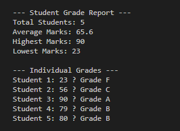

#  Student Grade Analyzer (Java Console Project)

A simple **Java console application** that analyzes student grades using **arrays**.  
It takes student marks as input and calculates:

- ✅ Average Marks  
- ✅ Highest Marks  
- ✅ Lowest Marks  
- ✅ Individual Grades (A, B, C, F)

---

##  Features
- Input marks for multiple students
- Display overall statistics (average, highest, lowest)
- Assign grades based on marks
- Simple and beginner-friendly Java program

---

## Concepts Covered
- Variables & Data Types  
- Arrays (1D)  
- Loops (`for`)  
- Conditional Statements (`if-else`)  
- Functions inside `main`  

---

##  File
- `StudentGradeAnalyzer.java`

##  How to Run
1. Clone this repository:

   git clone https://github.com/SameeraAfridi/Student-Grade-Analyzer.git
